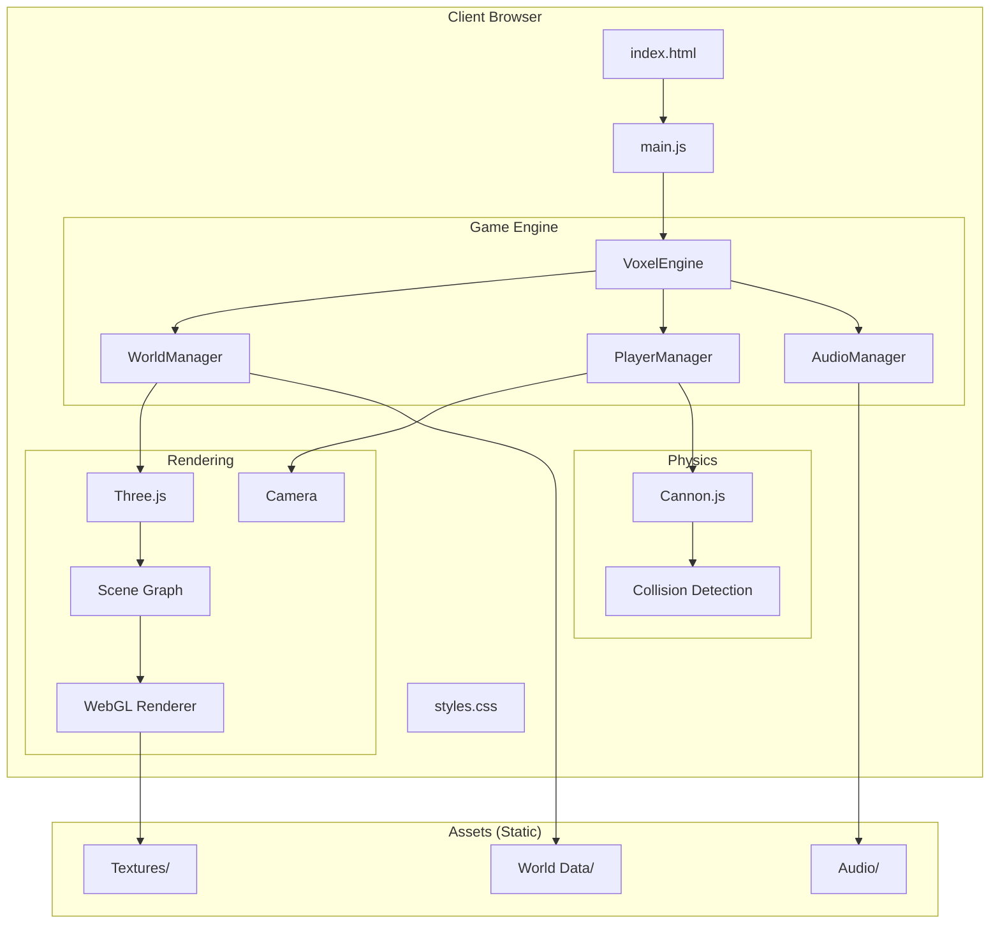
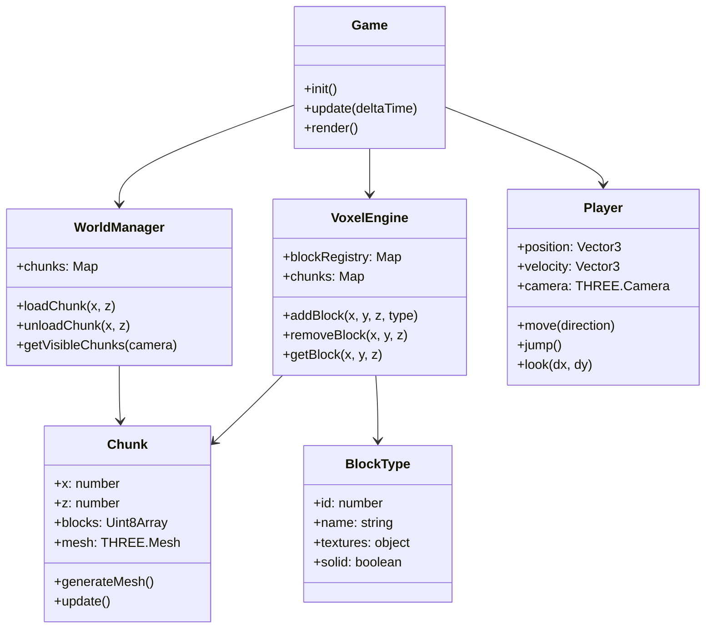
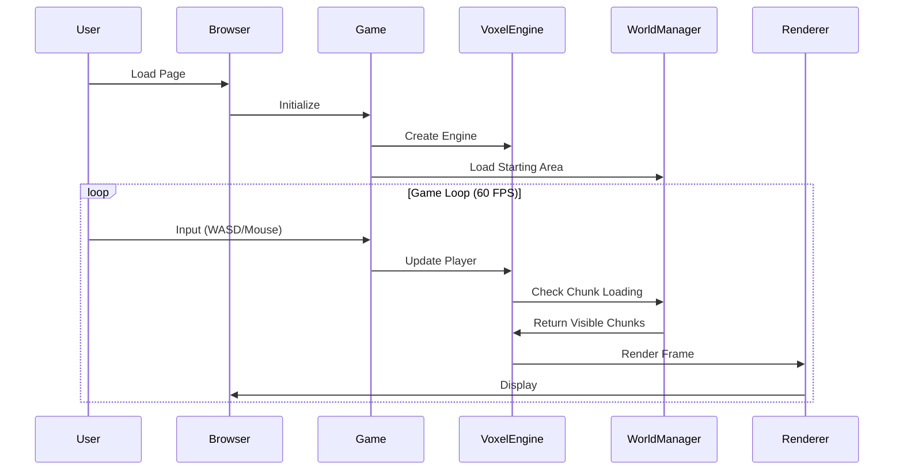
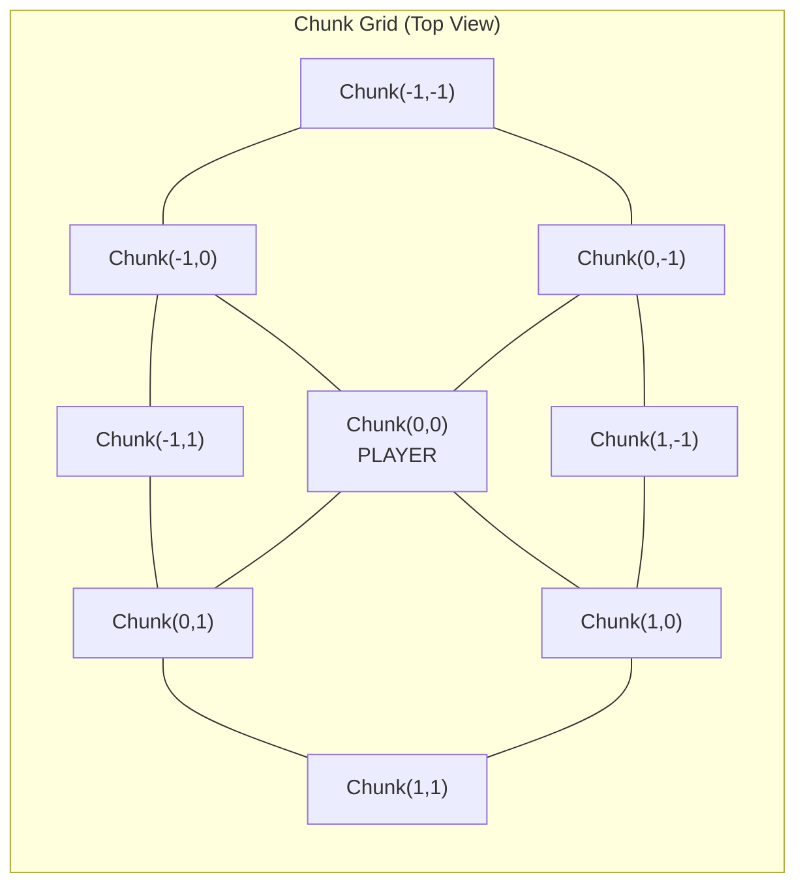
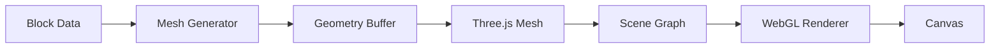
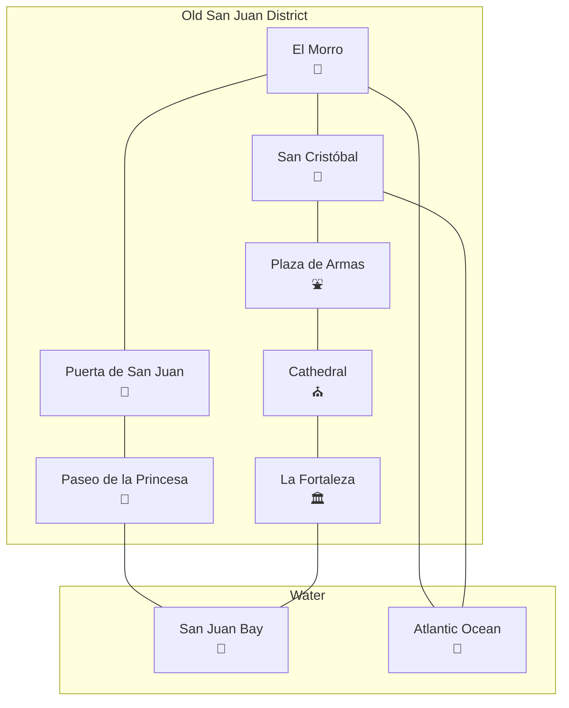

# Minecraft Old San Juan - Architecture Overview

> Technical architecture and system design documentation

---

## System Architecture



---

## Component Diagram



---

## Data Flow Diagram



---

## Chunk System



**Chunk Properties:**
- Size: 16×16×256 blocks (x, z, y)
- Storage: Flat Uint8Array for block IDs
- Mesh: Generated on demand, cached
- Load radius: 4-8 chunks from player

---

## Directory Structure

```
minecraft_old_SJU/
├── docs/
│   ├── implementation_plan.md
│   ├── task.md
│   ├── architecture_overview.md  ← You are here
│   └── data_contract.md
├── src/
│   ├── engine/
│   │   ├── VoxelEngine.js
│   │   ├── Chunk.js
│   │   ├── BlockRegistry.js
│   │   └── MeshBuilder.js
│   ├── game/
│   │   ├── Player.js
│   │   ├── Camera.js
│   │   ├── DayNight.js
│   │   └── Audio.js
│   ├── world/
│   │   ├── WorldManager.js
│   │   ├── ChunkLoader.js
│   │   └── structures/
│   └── main.js
├── static/
│   ├── textures/
│   ├── audio/
│   └── models/
├── data/
│   ├── blocks.json
│   └── structures/
├── templates/
├── scripts/
├── tests/
├── index.html
├── style.css
├── package.json
├── README.md
├── AGENT.md
└── .gitignore
```

---

## Technology Stack Details

### Rendering Pipeline



### Key Libraries

| Library | Version | Purpose |
|---------|---------|---------|
| Three.js | ^0.160.0 | 3D rendering |
| Cannon.js | ^0.6.2 | Physics |
| Howler.js | ^2.2.4 | Audio |
| Vite | ^5.0.0 | Build tool |

---

## Performance Targets

| Metric | Target | Measurement |
|--------|--------|-------------|
| Frame Rate | 60 FPS | Chrome DevTools |
| Load Time | <3 sec | Lighthouse |
| Chunk Load | <100ms | Performance API |
| Memory | <512MB | Task Manager |

---

## Old San Juan Map Layout


