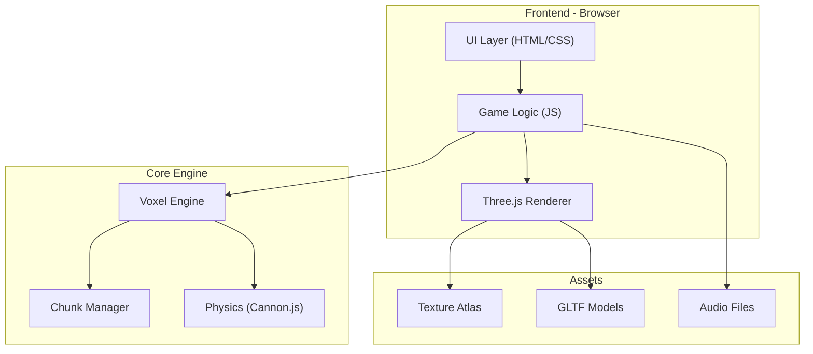

# Minecraft Old San Juan - Implementation Plan

> **Project Goal**: Create a Minecraft-style voxel game set in historic Old San Juan, Puerto Rico, featuring accurate architectural representation of colonial buildings, cobblestone streets, and iconic landmarks.

---

## User Review Required

> [!IMPORTANT]
> **Technology Stack Decision**  
> This plan proposes using **Three.js** (WebGL) for browser-based 3D rendering. Alternative options include:
> - **Unity + WebGL export** (more powerful, requires Unity knowledge)
> - **Babylon.js** (alternative WebGL library)
> - **Python + PyGame/Panda3D** (desktop-only)
>
> Please confirm the preferred approach.

> [!WARNING]
> **Scope Clarification Needed**
> - Should this include multiplayer functionality?
> - What level of Minecraft mechanics to replicate (mining, crafting, survival)?
> - Focus on exploration/tourism or full gameplay?

---

## Project Overview

### Vision
A voxel-based exploration game recreating the historic district of Old San Juan, PR. Players can explore:
- **El Morro** (Castillo San Felipe del Morro)
- **La Fortaleza** (Governor's Mansion)
- **Calle del Cristo** and cobblestone streets
- **San Juan Cathedral**
- **Colorful colonial buildings**
- **City walls and gates**

### Core Features (Phase 1 - MVP)
1. Voxel rendering engine
2. First-person camera controls
3. Basic Old San Juan terrain/buildings
4. Day/night cycle
5. Walking/exploration mechanics

### Extended Features (Phase 2+)
1. NPC tour guides with historic facts
2. Interactive landmarks
3. Building interior exploration
4. Weather effects (tropical rain, sunshine)
5. Sound design (coquí frogs, ocean waves)

---

## Proposed Tech Stack

| Component | Technology | Rationale |
|-----------|------------|-----------|
| **Rendering** | Three.js + WebGL | Browser-based, no install required |
| **Game Logic** | JavaScript/TypeScript | Native web integration |
| **Build Tool** | Vite | Fast HMR, modern bundling |
| **3D Models** | Blender → glTF | Open source, web-optimized |
| **Audio** | Howler.js | Cross-browser audio support |
| **Physics** | Cannon.js | Lightweight physics engine |

---

## Proposed Changes

### Phase 0: Foundation (Current Phase - Planning)

#### [NEW] [implementation_plan.md](file:///C:/Users/ely.x.colon/.gemini/antigravity/scratch/minecraft_old_SJU/docs/implementation_plan.md)
- This document - project roadmap and technical decisions

#### [NEW] [task.md](file:///C:/Users/ely.x.colon/.gemini/antigravity/scratch/minecraft_old_SJU/docs/task.md)
- Detailed task checklist with phases

#### [NEW] [architecture_overview.md](file:///C:/Users/ely.x.colon/.gemini/antigravity/scratch/minecraft_old_SJU/docs/architecture_overview.md)
- System diagrams and component relationships

#### [NEW] [data_contract.md](file:///C:/Users/ely.x.colon/.gemini/antigravity/scratch/minecraft_old_SJU/docs/data_contract.md)
- Voxel data format, world chunk structure

---

### Phase 1: Core Engine

#### [NEW] src/engine/VoxelEngine.js
- Voxel rendering system
- Chunk management
- Block types (stone, wood, colored stucco)

#### [NEW] src/engine/Camera.js
- First-person camera controls
- WASD + mouse look navigation

#### [NEW] src/engine/World.js
- World generation
- Chunk loading/unloading

---

### Phase 2: Old San Juan Assets

#### [NEW] data/blocks/
- Block type definitions (cobblestone, Spanish tiles, etc.)

#### [NEW] data/structures/
- Pre-built structures (buildings, walls, landmarks)

#### [NEW] static/textures/
- Texture atlas for block faces

---

### Phase 3: Game Features

#### [NEW] src/game/Player.js
- Player state and movement

#### [NEW] src/game/DayNight.js
- Day/night cycle system

#### [NEW] src/game/Audio.js
- Ambient sounds, music

---

## Architecture Overview

---

## Verification Plan

### Development Verification
1. **Local Dev Server**: `npm run dev` - hot reload during development
2. **Build Check**: `npm run build` - ensure production bundle compiles
3. **Browser Testing**: Manual verification in Chrome, Firefox, Edge

### User Acceptance Testing
- Navigate the world using WASD + mouse
- Verify El Morro structure visibility
- Check day/night cycle transitions
- Confirm texture loading and performance (target: 60 FPS)

### Manual Verification Steps
1. Run `npm install` then `npm run dev`
2. Open browser to localhost URL
3. Move around with WASD keys
4. Look around with mouse
5. Verify landmarks are recognizable

---

## References & Inspiration

- [Three.js Documentation](https://threejs.org/docs/)
- [Minecraft Voxel Tutorials](https://sites.google.com/view/letsmakeavoxelengine)
- [Old San Juan Historic Photos](https://www.nps.gov/saju/index.htm)
- [Puerto Rico Tourism - Old San Juan](https://www.discoverpuertorico.com)

---

## Next Steps

1. ✅ Create project scaffolding
2. ✅ Generate planning documents
3. ⏳ **User review and approval**
4. ⬜ Set up Vite + Three.js project
5. ⬜ Create basic voxel renderer
6. ⬜ Design Old San Juan block palette
